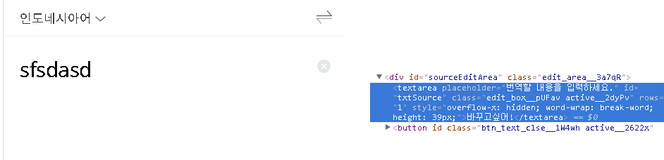
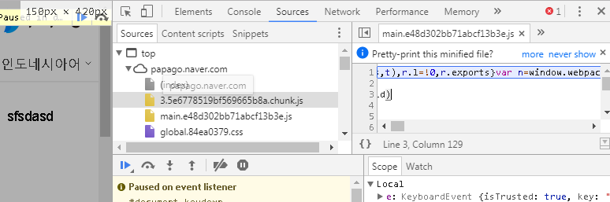
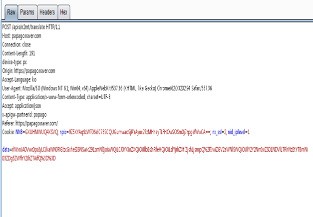
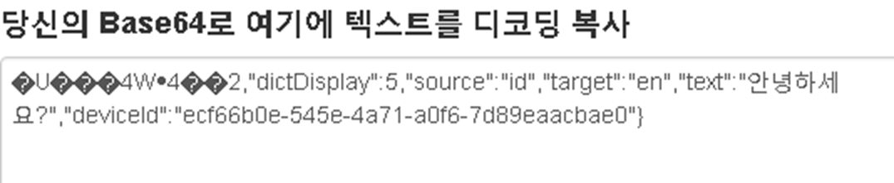
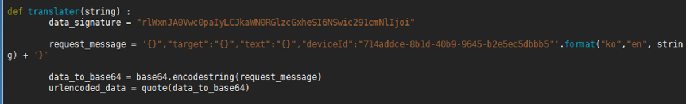

# Unlimited translator
> 글자수 제한 없는 번역기 프로젝트

파파고의 5000자 제한을 무시하고 번역을 진행합니다.

## 사용방법
parse.py 을 이용하여 번역을 진행합니다.

```sh
parse.py 번역할_문자열의_언어코드 번역될_문자열의_언어코드 문자열
```

| 언어           | 언어코드    |
|----------------|-------------|
| 한국어         | ko          |
| 영어           | en          |
| 일본어         | ja          |
| 중국어(간체)   | zh-CN       |
| 중국어(번체)   | zh-TW       |
| 스페인어       | es          |   
| 베트남어       | vi          | 
| 태국어         | th          |
| 인도네시아어   | id          |


* 2019.02.04
	* python2.0으로 작성된 코드가 문제가 매우 많아 python3.0으로 교체하였습니다.
	* 문자열을 자르는 소스부분은 건들기 싫어서 버그가 그대로 존재합니다. 그냥 이런 방법도 있구나~ 하는 느낌으로 봐주세요.


함께 올라간 tomcat 폴더는 혹시 테스트를 해보고싶은 분을 위한 폴더이다.
tomcat run하고 포트 2831로 접솝하면 된다. 학교 과제로 만들었던거라 괜히 로그인이니 뭐니 이상한 기능 넣었었는데 일단 다 빼버렸다.


## 개발과정

인공지능이 발달함에 따라 번역기의 성능이 나날이 높아져가고 있다.

이 프로젝트는 대학교 웹서비스설계 과목의 팀 프로젝트로 진행했던 것 이다.
학기 프로젝트였지만 귀차니즘에 팅가팅가 놀다가 발표 하루전날에 모든걸 만들어버리는 기염을 토해내느라 나도 토할뻔했지만..
프로젝트 진행을 함께해준 박XX, 이XX 에게 감사의 마음을 전하기는 개뿔 밥사야 한다 이시키들 ㅡㅡ.

장난이고 ,대략적인 프로젝트의 설계를 말하도록 하겠다.


사진1. 파파고의 글 입력 부분.

파파고(다른 여타 번역기 포함)는 5000자의 번역 제한을 가지고 있다.
공부를 하다보면 영문으로 된 논문을 읽을때가 많은데 비루한 영어실력을 이용하여 읽자니 머리가 괴롭고, 그 긴 글자를 나눠서 번역하자니 귀찮을때가 아주 많았다.
그래서 생각한 아주 간단한 방법. 

"그럼 5000자씩 끊어서 번역한다음 붙이면 되잖아?"

바로 실행에 옮겼다.

솔직히 매우 빠르게 끝날줄 알았다.
어딘가로 데이터를 보낼꺼고, 그냥 그 데이터를 살짝 조작만 하면 바로바로 결과가 튀어나울줄 알았다. 

제일 먼저 생각한 방법은, PhantomJs같은 headerless 브라우저를 이용하여 파파고 페이지에 접속해서 지속적으로 요청과 응답을 받아와서 응답을 붙여 저장하면 될것. 이라는 방법이었다. 

파파고 http헤더 분석할 필요도 없고 아주 간단한 방법이라 생각했는데...

사진2. 소스를 편집했지만 변하지 않는 내용....??

textarea의 내용을 수정해도 글이 변하지 않는다...? 생각지도 못한 부분이었다. 조금 보다보니

사진3. keyboardEvent를 잡아내는 ????.js
파파고에 글이 입력될때마다 자동 언어선택 기능을 구동시키기 위해서 keyboardEvent를 잡아서 서버에 비동기통신을 통한 요청을 보내는 행위를 하는데 이러한것 때문에 내용이 바뀌지 않는다는 추측을 하게 되었다. (이유를 아시는 분 있으시면 답글 부탁드립니다.)
물론 시간만 있으면 이유를 알아낼 수 있었지만 프로젝트 기간에 매우 쫒기던 상황이라 그러지 못했다고 스스로 자기위로를....

쨋든.  이러한 이유로 인해 phantomJs 를 이용하는것을 포기하고 request헤더 분석으로 방향을 틀었다.

사진4. 파파고 번역시 request헤더

그래서 바로 http request header를 봤고, data부분이 단순히 base64인코딩 되어있어 인코딩을 풀어보았다.

사진5. base64 디코딩을 진행한 data

생각한것과 같이 data부분에 json형태로 데이터를 전송하는것을 확인할 수 있었다.
앞부분을 보면 글자가 깨지는것을 볼 수 있는데, 이 부분을 여러 테스트 결과 바뀌지 않는것을 확인하였다. 왜있는지는 아직도 잘 모르겠다.

인코딩방식이 base64이므로 문자열을 잘 자르면 데이터를 손상시키지 않고 잘라낼 수 있다.


사진6. 파이썬을 이용한 데이터 생성

* 2019.02.04
	* 깃에 올리려고 테스트 해본 결과 requests로 데이터 전송 및 수신 되는것 확인.
	* 헤드리스기반 파싱이 아닌 python기반 크롤링으로 변경.

/*
그렇게 필요한 데이터를 찾아내고, 다시 만들어내는것까지 소스를 작성하였다. 이제 이거를 requests나 urllib로 전송하면 데이터가 오겠지 ^오^ 하는 생각으로 코드를 작성했는데... 결과는 똥망이었다. 데이터가 오질 않는다... 
user-agent를 검사하나? 해서 바꿔보기도 하고.. 이런저런 삽질 많이했다. 물론 지금도 이유를 모른다.

그렇게 오랜시간 삽질을 하다가. 문득, 헤더를 직접 보내는게 안먹힌다면, 실제 유저가 접근하는것처럼 하면...? 이란 생각을하고 처음에 묻어버렸다 phantomJS를 다시 꺼냈다.
*/	

위의 분석과정을 통해 개발됨.

